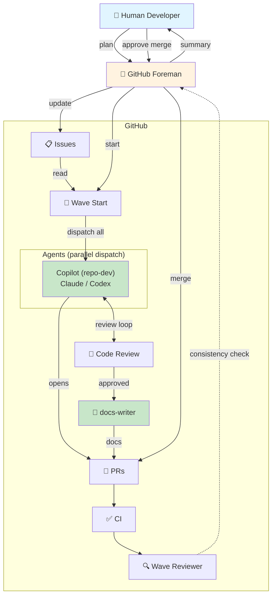
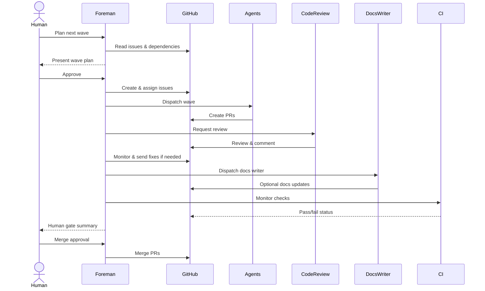

# GitHub Foreman

GitHub Foreman is a Copilot agent plugin for coordinating GitHub issue-to-PR work across Copilot, Claude, Codex, code review, CI, documentation, and human merge gates.

The plugin packages:

- a main `github-foreman` custom agent
- supporting subagents for documentation and local implementation
- skills that preserve the important GitHub orchestration details from the original Foreman workflow

## Contents

```text
github-foreman/
  plugin.json
  agents/
    github-foreman.agent.md
    docs-writer.agent.md
    repository-developer.agent.md
  skills/
    cli-operations/
    agent-dispatch/
    foreman-workflow/
    pr-review-loop/
    repo-intake/
```

## Install locally

```sh
copilot plugin install /Users/eldrickwega/Projects/github-foreman
copilot plugin list
```

Plugin installs are cached. Re-run the install command after editing this directory.

## Verify

In a fresh Copilot session:

```text
/agent
/skills list
```

Look for the `github-foreman` agent and these skills:

- `agent-dispatch`
- `cli-operations`
- `foreman-workflow`
- `pr-review-loop`
- `repo-intake`

## Main workflow

The Foreman agent follows this sequence:

1. Plan issue waves from repository evidence.
2. Dispatch approved work to Copilot, Claude, or Codex.
3. Monitor for PR creation.
4. Request and evaluate Code Review Agent feedback.
5. Dispatch the docs writer through `gh agent-task` when available.
6. Poll CI and send failures back to the owning agent.
7. Check docs and multi-PR consistency.
8. Present a human merge gate.
9. Merge only after explicit human approval.

### Interaction model



### Sequential flow



## Important implementation details

- Claude and Codex assignment uses GraphQL `addAssigneesToAssignable`; REST assignment and `gh issue edit --add-assignee` do not reliably work for these bot accounts.
- Foreman is moving toward CLI-first GitHub management: issue intake, PR discovery, review state, checks, and agent-task state should prefer `gh` commands with `--json`; GitHub MCP tools remain fallback while this is experimental.
- When Foreman selects Copilot as the cloud implementer, it should prefer `gh agent-task create --custom-agent repository-developer` so Copilot uses the repository-developer custom agent profile, when the target repo exposes `.github/agents/repository-developer.agent.md`.
- Docs review runs at the end of a clean review loop through `gh agent-task create --custom-agent docs-writer` when the target repository exposes `.github/agents/docs-writer.agent.md`; otherwise Foreman falls back to the local docs-writer subagent.
- Preserve the polling cadence from the original Foreman workflow:
  - 300s initial wait after dispatch
  - 120s PR polling
  - 300s wait after requesting review
  - 120s review polling
  - 180s wait after fix requests
  - 120s docs-writer task polling
  - 120s CI polling
- The plugin intentionally does not include hooks, MCP servers, or LSP configuration in the first version.

## CLI-first experiment

`gh agent-task` is preview, so the plugin keeps a CLI-first-but-not-CLI-only policy for now.

Preferred commands:

```sh
gh issue list --repo OWNER/REPO --json number,title,body,labels,milestone,state,updatedAt,url
gh issue view ISSUE --repo OWNER/REPO --json number,title,body,comments,labels,milestone,state,closedByPullRequestsReferences,updatedAt,url
gh pr list --repo OWNER/REPO --json number,title,headRefName,baseRefName,author,isDraft,state,url,latestReviews,reviewDecision,statusCheckRollup,updatedAt
gh pr view PR --repo OWNER/REPO --json number,title,headRefName,baseRefName,isDraft,state,url,comments,reviews,latestReviews,reviewDecision,statusCheckRollup,commits,files,updatedAt
gh pr checks PR --repo OWNER/REPO --json bucket,completedAt,description,event,link,name,startedAt,state,workflow
gh agent-task create --repo OWNER/REPO --base BASE_BRANCH --custom-agent repository-developer -F implementation-task.md
gh agent-task create --repo OWNER/REPO --base BASE_BRANCH --custom-agent docs-writer -F docs-writer-task.md
gh agent-task view SESSION_ID --repo OWNER/REPO --json id,name,state,pullRequestNumber,pullRequestState,pullRequestTitle,pullRequestUrl,updatedAt --jq .
```

Before dispatching a cloud custom agent, Foreman should check whether the target repo exposes it:

```sh
gh api repos/OWNER/REPO/contents/.github/agents/repository-developer.agent.md --jq .path
gh api repos/OWNER/REPO/contents/.github/agents/docs-writer.agent.md --jq .path
```

If the `repository-developer` preflight fails, fall back to native/default Copilot assignment and report the fallback. If the `docs-writer` preflight fails, use the local docs-writer subagent and report the fallback.

## Shadowing note

Copilot uses first-found-wins precedence for agents and skills. Loose user-profile agents in `~/.copilot/agents` with the same agent IDs can shadow plugin agents. The migrated Foreman agents were removed from the user profile so this plugin version can load cleanly.
