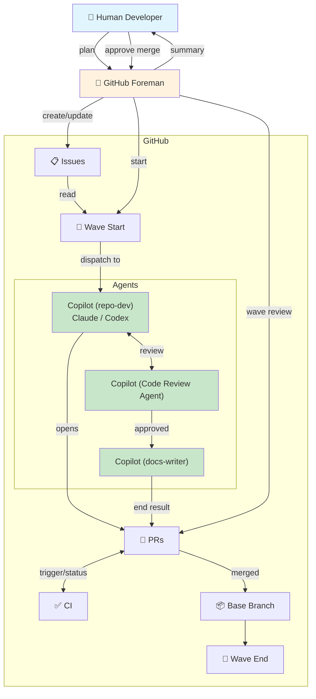
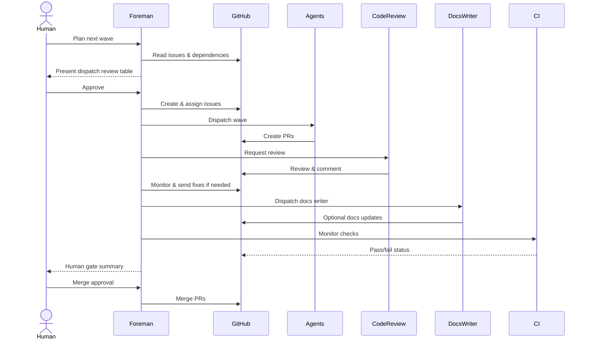

# GitHub Foreman

GitHub Foreman is a Copilot agent plugin for coordinating GitHub issue-to-PR work across Copilot, Claude, Codex, code review, CI, documentation, and human merge gates.

## Why

AI agents can write code — but coordinating multiple agents working in parallel across a real repository is a different problem. Without orchestration, agents conflict, duplicate work, skip review, or leave documentation behind. Squad solves this problem beautifully on your local machine. Foreman is similar but opinionated on GitHub and Cloud agents. It plans work into waves, dispatches the right agent for each issue, runs the review and docs loop, and only presents a merge gate when the wave is actually ready.

## Human interactions

Foreman is designed so a human only needs to act at two points in the cycle:

1. **Approve the dispatch review.** Foreman reads the repo's issues, proposes a wave of work, and shows a table before dispatching any agents. The table includes each issue, target agent, model/profile, dispatch mechanism, base branch, dependency context, validation focus, and risks. You can adjust scope before approving.

2. **Approve the merge.** After agents complete their work, code review, and docs pass, Foreman presents a summary of all PRs in the wave and waits for explicit merge approval. Nothing merges automatically.

Everything in between — dispatching agents, monitoring sessions and draft PRs, running review loops, tracking CI, invoking the docs writer — is handled by Foreman.

The plugin packages:

- a main `github-foreman` custom agent
- supporting local handoff agents for dev work and documentation
- skills that preserve the important GitHub orchestration details from the original Foreman workflow

## Contents

```text
github-foreman/
  plugin.json
  agents/
    github-foreman.agent.md
    docs-writer.agent.md
    repository-developer.agent.md
  hooks/
    session-start.js
    stop.js
  skills/
    cli-operations/
    agent-dispatch/
    foreman-workflow/
    pr-review-loop/
    repo-intake/
```

## Install

```sh
copilot plugin install ewega/github-foreman
copilot plugin list
```

## Main workflow

The Foreman agent follows this sequence:

1. Plan issue waves from repository evidence.
2. Draft and create issues when needed (inspect repo templates, present draft before creating).
3. Present a dispatch review table and wait for approval before assigning Copilot, Claude, or Codex.
4. Dispatch approved work, then keep monitoring automatically. Session IDs, assignment confirmations, and draft PR links are progress updates, not completion.
5. Monitor for PR creation. For resumed waves, use `SessionStart` hook context backed by the local `.github/foreman/wave-state.json` when it describes an active wave; otherwise read the latest comment on each existing PR to determine which phase to jump back into.
6. Request and evaluate Code Review Agent feedback.
7. Dispatch the docs writer through `gh agent-task` when available.
8. Poll CI and send failures back to the owning agent.
9. Check docs and multi-PR consistency.
10. Present a human merge gate.
11. Merge only after explicit human approval.

### Interaction model



### Sequential flow



## Important implementation details

- Claude and Codex assignment uses GraphQL `addAssigneesToAssignable`; REST assignment and `gh issue edit --add-assignee` do not reliably work for these bot accounts.
- Foreman is moving toward CLI-first GitHub management: issue intake, PR discovery, review state, checks, and agent-task state should prefer `gh` commands with `--json`; GitHub MCP tools remain fallback while this is experimental.
- Before assigning agents, Foreman presents a dispatch review table that identifies each issue, selected agent, model/profile, dispatch mechanism, base branch, dependency context, validation focus, and risks. Only approved rows are dispatched.
- When Foreman selects Copilot as the cloud implementer, it should prefer `gh agent-task create --custom-agent repository-developer` so Copilot uses the repository-developer custom agent profile, when the target repo exposes `.github/agents/repository-developer.agent.md`.
- After dispatch succeeds, Foreman treats session IDs, assignment confirmations, draft PR links, and WIP PR status as interim progress signals. It continues sleeping and polling through review, docs, CI, and consistency until the human merge gate unless a real blocker requires human input.
- Docs review runs at the end of a clean review loop through `gh agent-task create --custom-agent docs-writer` when the target repository exposes `.github/agents/docs-writer.agent.md`; otherwise Foreman reports that the docs task is unavailable and does not invoke `docs-writer` locally unless the human explicitly chooses the local handoff.
- Preserve the polling cadence from the original Foreman workflow:
  - 300s initial wait after dispatch
  - 120s PR polling
  - 300s wait after requesting review
  - 120s review polling
  - 180s wait after fix requests
  - 120s docs-writer task polling
  - 120s CI polling
- When resuming an interrupted wave, Foreman first consumes any `SessionStart` hook context and uses the local `.github/foreman/wave-state.json` only when it describes an active wave. If hook context is unavailable or the saved state is terminal, Foreman falls back to the latest comment on each open PR (`gh pr view <number> --comments --json comments`) to infer the active phase (review loop, CI gate, docs task, or human gate) and jumps directly there instead of restarting from Phase 3.
- Foreman keeps orchestration state in the local workspace under `.github/foreman/wave-state.json`. This file is workspace state, not product code, and should not be committed as part of repository changes.
- Before the human gate, Foreman writes an in-flight snapshot such as `phase: human-gate`, `status: awaiting-merge-approval`, and `active: true`. After a wave is fully complete, Foreman should either overwrite the file with the next active wave or mark the prior wave terminal with `status: completed` and `active: false`.
- Foreman uses agent-scoped `SessionStart` and `Stop` hooks to load and guard `.github/foreman/wave-state.json`. In VS Code, enable `chat.useCustomAgentHooks` to activate them. The hook scripts use `node`, so `node` must be available on the local PATH.

## CLI-first experiment

`gh agent-task` is preview, so the plugin keeps a CLI-first-but-not-CLI-only policy for now.

Preferred commands:

```sh
gh issue list --repo OWNER/REPO --json number,title,body,labels,milestone,state,updatedAt,url
gh issue view ISSUE --repo OWNER/REPO --json number,title,body,comments,labels,milestone,state,closedByPullRequestsReferences,updatedAt,url
gh pr list --repo OWNER/REPO --json number,title,headRefName,baseRefName,author,isDraft,state,url,latestReviews,reviewDecision,statusCheckRollup,updatedAt
gh pr view PR --repo OWNER/REPO --json number,title,headRefName,baseRefName,isDraft,state,url,comments,reviews,latestReviews,reviewDecision,statusCheckRollup,commits,files,updatedAt
gh pr checks PR --repo OWNER/REPO --json bucket,completedAt,description,event,link,name,startedAt,state,workflow
gh agent-task create --repo OWNER/REPO --base BASE_BRANCH --custom-agent repository-developer -F implementation-task.md
gh agent-task create --repo OWNER/REPO --base BASE_BRANCH --custom-agent docs-writer -F docs-writer-task.md
gh agent-task view SESSION_ID --repo OWNER/REPO --json id,name,state,pullRequestNumber,pullRequestState,pullRequestTitle,pullRequestUrl,updatedAt --jq .
```

Before dispatching a cloud custom agent, Foreman should check whether the target repo exposes it:

```sh
gh api repos/OWNER/REPO/contents/.github/agents/repository-developer.agent.md --jq .path
gh api repos/OWNER/REPO/contents/.github/agents/docs-writer.agent.md --jq .path
```

If the `repository-developer` preflight fails, fall back to native/default Copilot assignment and report the fallback. If the `docs-writer` preflight fails, skip the docs task and report the limitation; do not invoke the local docs-writer agent automatically.

## Shadowing note

Copilot uses first-found-wins precedence for agents and skills. Loose user-profile agents in `~/.copilot/agents` with the same agent IDs can shadow plugin agents. The migrated Foreman agents were removed from the user profile so this plugin version can load cleanly.
